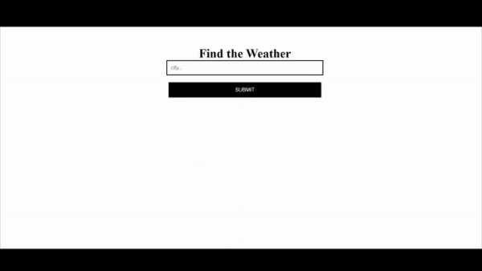

# 


# Weather-Site-Scraping
## 💻 About this project (sobre este projeto)
:us: This project aimed to create a simple website developed with Django to show weather information scraped from Google.

:brazil: Este projeto teve por objetivo criar um website simples desenvolvido com Django para apresentar informações do tempo obtida do Google (por WebScraping)

---
## ⚙️ Project demonstration (demontração do projeto)
Description: The algorithm uses Beautifulsoup (BS4) to search and get weather information on Google. Then, it presents this data on a Webpage (developed in Django).

<p align="center"> 

---
	
## 💡 Knowledge acquired (conhecimentos adquiridos)

- During this project, I learned:
  - pending to be written;
  - pending to be written; and
  - pending to be written.

---

## 🚀 How to execute this project (como executar este projeto)

  - To run the code it is recommended to use an IDE, such as Pycharm;
  - Just clone this project, open on your IDE and set the command on terminal: python manage.py runserver;
  - Note: Before running, remember to unzip the folder env.zip on your main folder (where are other folders such as .idea and code_in_django). It was necessary to zip the "env" folder because git was not allowing to upload the entire folder.

### 🎲 Requirements (requisitos)

There is no recommendation to run the executable apps.

To run the code, it is recommended to install the following Python Packaged:
- asgiref==3.3.1
- beautifulsoup4==4.9.3
- certifi==2020.12.5
- chardet==4.0.0
- Django==3.1.7
- idna==2.10
- pytz==2021.1
- requests==2.25.1
- soupsieve==2.2.1
- sqlparse==0.4.1
- urllib3==1.26.4

To install all these packages, just run the following command on your terminal: pip install -r requirements.txt

#### Running the codes (rodando os códigos)

```bash

# Clone this repository
$ git clone git@github.com:rosadigital/weather-site-scraping.git

# Open the repository on pycharm

```

---

## 🦸 Author (autor)


Felipe Rosa on [LinkedIn](https://www.linkedin.com/in/felipe-rosa/)

---

## 📝 License (licença)

This project is licensed under [MIT](./LICENSE).

Este projeto esta sobe a licença [MIT](./LICENSE).

Made with ❤️ by Felipe Rosa 👋🏽 [Contact here!](https://www.linkedin.com/in/felipe-rosa/)

Feito com ❤️ por Felipe Rosa 👋🏽 [Entre em contato!](https://www.linkedin.com/in/felipe-rosa/)

--
